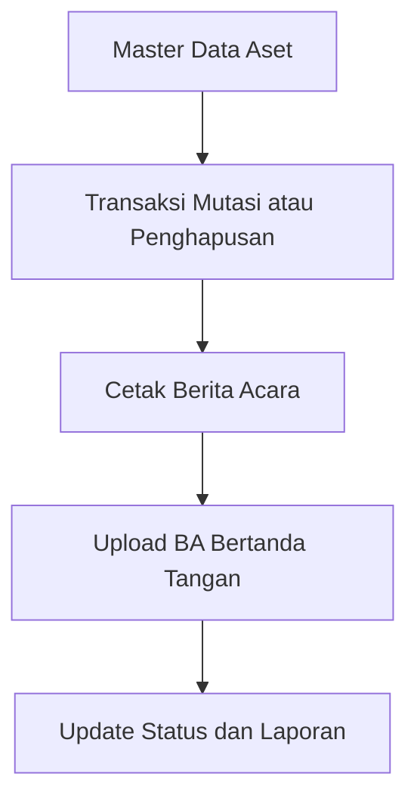

# Workflow Video Demo Fitur Berita Acara

Dokumen ini dipakai sebagai panduan rekaman video revisi untuk dosen penguji. Fokus utama video adalah menjawab catatan revisi: membedakan aset dan inventaris barang, merelasikan master data dengan transaksi, serta melengkapi sistem dengan berita acara, notifikasi, dan validasi data.

## Tujuan Demo

Menjelaskan bahwa sistem inventaris aset MAN 2 HSU sudah memiliki alur Berita Acara sebagai dokumen resmi untuk proses transaksi aset, terutama mutasi aset dan penghapusan aset.

Fitur yang ditonjolkan:

1. Master data aset terhubung dengan kategori dan lokasi.
2. Transaksi mutasi aset menggunakan data aset, lokasi asal, dan lokasi tujuan.
3. Berita Acara/BAST dapat dicetak dan diunduh PDF.
4. Scan Berita Acara yang sudah ditandatangani wajib diunggah sebelum proses diselesaikan.
5. Sistem memiliki validasi agar aset yang sedang dimutasi atau diajukan penghapusan tidak diproses sembarangan.
6. Notifikasi Telegram dikirim saat ada pengajuan dan penyelesaian transaksi.

## Alur Singkat Fitur Berita Acara

## Bagian Video yang Direkam

| Menit | Tampilan yang Direkam | Narasi Utama |
|---|---|---|
| 00:00 - 00:30 | Halaman login dan dashboard | Perkenalkan nama, judul skripsi, dan tujuan demo revisi. |
| 00:30 - 01:20 | Menu Data Aset | Jelaskan perbedaan jenis barang: Aset Tetap dan Inventaris Barang. |
| 01:20 - 02:10 | Form tambah/edit aset | Jelaskan relasi master data: kategori, lokasi, kondisi, sumber dana, QR code. |
| 02:10 - 03:40 | Menu Mutasi Aset | Demo transaksi mutasi dari lokasi asal ke lokasi tujuan. |
| 03:40 - 05:00 | Halaman Konfirmasi Penerimaan Mutasi | Demo cetak/unduh BAST, upload scan BAST, dan finalisasi penerimaan. |
| 05:00 - 06:20 | Halaman Berita Acara Mutasi | Tampilkan kop surat, nomor BA, data aset, lokasi asal, lokasi tujuan, dan tanda tangan. |
| 06:20 - 07:30 | Penghapusan aset | Demo pengajuan hapus, alasan, bukti foto, cetak BA penghapusan. |
| 07:30 - 08:30 | Upload BA penghapusan dan laporan | Jelaskan soft delete: aset hilang dari inventaris aktif tapi tetap masuk laporan penghapusan. |
| 08:30 - 09:10 | Log notifikasi atau bukti Telegram | Jelaskan sistem mengirim notifikasi saat transaksi diajukan/diselesaikan. |
| 09:10 - 10:00 | Penutup | Simpulkan bahwa revisi dosen sudah dijawab melalui fitur BA, validasi, notifikasi, dan laporan. |

## Workflow Demo Mutasi Aset

1. Login sebagai admin atau petugas.
2. Buka menu `Mutasi Aset`.
3. Klik `Tambah Mutasi`.
4. Pilih aset, misalnya proyektor/laptop/AC.
5. Sistem menampilkan lokasi asal aset dari data master.
6. Pilih lokasi tujuan yang berbeda.
7. Isi tanggal mutasi dan keterangan.
8. Simpan pengajuan mutasi.
9. Sistem mengubah status aset menjadi `in_transit` atau sedang dimutasi.
10. Sistem mengirim notifikasi Telegram pengajuan mutasi.
11. Buka halaman `Konfirmasi Penerimaan Mutasi`.
12. Klik `Buka / Cetak Lembar BAST Resmi`.
13. Tampilkan halaman `Berita Acara Mutasi`.
14. Klik `Unduh PDF` atau `Cetak / Print`.
15. Upload scan/foto BAST yang sudah ditandatangani.
16. Klik konfirmasi penerimaan.
17. Sistem mengubah lokasi aset ke lokasi tujuan dan status mutasi selesai.
18. Buka laporan mutasi aset untuk membuktikan transaksi tercatat.

## Workflow Demo Penghapusan Aset

1. Buka menu `Data Aset`.
2. Pilih aset dengan kondisi rusak berat atau aset yang layak dihapus.
3. Klik ajukan hapus/finalisasi hapus sesuai tombol yang tersedia.
4. Isi alasan penghapusan, misalnya barang sudah rusak berat dan tidak dapat diperbaiki.
5. Upload bukti fisik kerusakan.
6. Sistem menyimpan status pengajuan penghapusan.
7. Buka tahap finalisasi penghapusan.
8. Klik `Cetak / Buka Berita Acara Resmi`.
9. Tampilkan halaman `Berita Acara Penghapusan Aset`.
10. Klik `Unduh PDF` atau `Cetak / Print`.
11. Upload scan Berita Acara yang sudah ditandatangani dan distempel.
12. Klik konfirmasi finalisasi.
13. Sistem melakukan soft delete: aset dikeluarkan dari data aktif, tetapi riwayat dan dokumen tetap tersimpan.
14. Buka `Laporan Penghapusan` untuk menunjukkan arsip penghapusan.

## Script Narasi Video

Assalamualaikum warahmatullahi wabarakatuh.

Perkenalkan, nama saya Muhammad Okta Maulana, NPM 2210020039. Pada video ini saya akan menjelaskan hasil revisi sistem inventaris aset MAN 2 Hulu Sungai Utara, khususnya pada fitur Berita Acara.

Sesuai catatan revisi dari dosen penguji, sistem perlu membedakan antara aset dan inventaris barang, merelasikan master data dengan transaksi, serta melengkapi proses dengan berita acara, notifikasi, dan validasi data.

Pertama, saya masuk ke sistem sebagai admin. Pada halaman dashboard terdapat ringkasan data aset, transaksi, dan laporan. Selanjutnya saya membuka menu Data Aset. Pada data aset ini terdapat field jenis barang, yaitu Aset Tetap dan Inventaris Barang. Jadi data barang sudah dibedakan sesuai jenisnya.

Pada form aset, data juga sudah terhubung dengan master kategori dan lokasi. Contohnya aset proyektor memiliki kategori elektronik dan ditempatkan di ruangan tertentu. Relasi ini penting karena nanti transaksi mutasi dan laporan akan mengambil data dari master aset, kategori, dan lokasi.

Selanjutnya saya membuka menu Mutasi Aset. Fitur ini digunakan ketika aset dipindahkan dari satu ruangan ke ruangan lain. Pada form tambah mutasi, saya memilih aset yang akan dipindahkan. Sistem otomatis menampilkan lokasi asal aset berdasarkan data master. Kemudian saya memilih lokasi tujuan, mengisi tanggal mutasi, dan keterangan.

Setelah disimpan, sistem membuat transaksi mutasi dengan status pending atau sedang dimutasi. Pada tahap ini lokasi aset belum langsung berubah, karena harus ada proses serah terima fisik terlebih dahulu. Sistem juga mengirim notifikasi Telegram sebagai pemberitahuan bahwa ada pengajuan mutasi aset.

Kemudian sistem mengarahkan ke halaman konfirmasi penerimaan mutasi. Di sini terdapat tombol untuk membuka atau mencetak Berita Acara Serah Terima. Saya klik tombol tersebut, lalu sistem menampilkan dokumen resmi dengan kop MAN 2 HSU, nomor berita acara, data aset, lokasi asal, lokasi tujuan, tanggal mutasi, dan bagian tanda tangan.

Dokumen ini dapat dicetak atau diunduh dalam bentuk PDF. Setelah dokumen ditandatangani, petugas wajib mengunggah scan atau foto BAST. Validasi ini dibuat agar transaksi mutasi tidak bisa diselesaikan tanpa dokumen berita acara.

Setelah file BAST diunggah dan dikonfirmasi, sistem memperbarui status mutasi menjadi selesai. Lokasi aset kemudian resmi berpindah ke lokasi tujuan, dan data tersebut masuk ke laporan mutasi aset.

Selain mutasi, sistem juga memiliki Berita Acara Penghapusan Aset. Alurnya dimulai dari data aset, lalu petugas mengajukan penghapusan aset dengan alasan dan bukti foto kerusakan. Setelah itu sistem menyediakan dokumen Berita Acara Penghapusan yang dapat dicetak atau diunduh PDF.

Pada tahap finalisasi, petugas wajib mengunggah scan Berita Acara yang sudah ditandatangani dan distempel. Setelah dikonfirmasi, sistem melakukan soft delete. Artinya aset tidak lagi tampil pada inventaris aktif, tetapi riwayat, nilai aset, bukti foto, dan dokumen berita acara tetap tersimpan pada laporan penghapusan.

Dengan demikian, fitur Berita Acara ini menjawab kebutuhan revisi karena proses transaksi tidak hanya mencatat perubahan data, tetapi juga menyediakan dokumen resmi, validasi berkas, notifikasi Telegram, dan arsip laporan.

Demikian penjelasan demo fitur Berita Acara pada sistem inventaris aset MAN 2 Hulu Sungai Utara. Wassalamualaikum warahmatullahi wabarakatuh.

## Poin yang Harus Ditekankan Saat Video

| Catatan Dosen | Jawaban di Sistem |
|---|---|
| Bedakan aset dan inventaris barang | Field `jenis_barang` pada tabel aset: `Aset Tetap` dan `Inventaris Barang`. |
| Relasikan master data dengan transaksi | Mutasi memakai relasi aset, kategori, lokasi asal, lokasi tujuan, dan user. |
| Lengkapi dengan berita acara | Ada halaman BA mutasi, BA peminjaman, BA pengembalian, dan BA penghapusan. |
| Tambah notifikasi | Pengajuan dan penyelesaian mutasi mengirim notifikasi Telegram. |
| Validasi data | Lokasi tujuan tidak boleh sama, aset pending hapus tidak bisa dimutasi, scan BA/BAST wajib diupload. |

## URL Fitur yang Ditunjukkan

| Fitur | URL |
|---|---|
| Data Aset | `/aset` |
| Tambah Mutasi | `/mutasi/tambah` |
| Konfirmasi Terima Mutasi | `/mutasi/konfirmasi-terima?id=ID_MUTASI` |
| Berita Acara Mutasi | `/berita-acara/mutasi?id=ID_MUTASI` |
| Finalisasi Penghapusan | `/aset/finalisasi-hapus?id=ID_ASET` |
| Berita Acara Penghapusan | `/berita-acara/penghapusan?id=ID_ASET` |
| Laporan Mutasi | `/laporan/mutasi` |
| Laporan Penghapusan | `/laporan/penghapusan` |
| Log Notifikasi | `/log-notifikasi` |

## Tips Rekaman

1. Siapkan satu aset contoh yang kondisinya baik untuk demo mutasi.
2. Siapkan satu aset contoh yang kondisinya rusak berat untuk demo penghapusan.
3. Siapkan file PDF/JPG dummy untuk upload BAST dan BA penghapusan.
4. Rekam layar dari awal login sampai laporan agar alurnya terlihat lengkap.
5. Saat membuka halaman BA, zoom sedikit agar kop surat dan nomor BA terlihat jelas.
6. Jangan terlalu lama di satu halaman; cukup tunjukkan field penting dan lanjut ke proses berikutnya.
